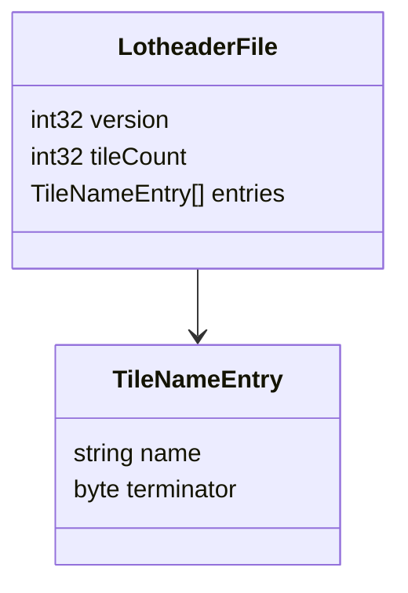

# Project Zomboid .lotheader File Format Description

## Overview

The .lotheader file format is a critical component of Project Zomboid's map system, serving as a companion to .lotpack
files. These files provide the essential mapping between numeric tile IDs and their corresponding texture names,
enabling proper interpretation of map data.

## File Organization

A .lotheader file consists of three main sections:

1. Version identifier (4 bytes)
2. Tile count header (4 bytes)
3. Tile name entries (variable length)

### Binary Structure

```
[File Structure]
┌─ Version Number (4 bytes)
├─ Tile Count (4 bytes)
└─ Tile Names
   ├─ Name 1 (variable + 1 byte)
   ├─ Name 2 (variable + 1 byte)
   └─ ... (repeats for Tile Count)
```

## Section Details

### Version Number

| Offset | Size | Type  | Description               |
|--------|------|-------|---------------------------|
| 0x00   | 4    | int32 | Format version identifier |

- Stored as a 32-bit little-endian integer
- Used for compatibility checking
- No known version variations as of current documentation

### Tile Count

| Offset | Size | Type  | Description                |
|--------|------|-------|----------------------------|
| 0x04   | 4    | int32 | Number of tile definitions |

- Stored as a 32-bit little-endian integer
- Determines the number of tile name entries that follow
- Typical range: 1-100,000 entries

### Tile Names Section

| Offset | Size     | Type   | Description                   |
|--------|----------|--------|-------------------------------|
| 0x08   | Variable | string | Sequence of tile name entries |

Each tile name entry:

- Variable-length string terminated by '\n' (0x0A)
- No length prefix or padding
- Index position (0-based) corresponds to tile ID in .lotpack
- Format: `category_group_id`, e.g., `furniture_tables_01_16`

## Important Format Notes

### String Encoding

- All strings use ASCII encoding
- No Unicode support required
- Maximum string length is not explicitly limited

### Byte Order

- All integer values use little-endian byte order
- Consistent with .lotpack file format

### File Naming

- Named as `X_Y.lotheader` where X,Y are cell coordinates
- Must match coordinates of corresponding .lotpack file

## File Parsing Guide

### Required Resources

1. Binary reader supporting little-endian integers
2. String parsing capability with newline detection
3. Error handling for format violations

### Parsing Process

1. Version Parsing

```python
version = reader.read_int32(little_endian=True)
if version < 0:
    raise LotHeaderParserError("Invalid version number")
```

2. Tile Count Reading

```python
tile_count = reader.read_int32(little_endian=True)
if tile_count <= 0 or tile_count > MAX_TILE_COUNT:
    raise LotHeaderParserError("Invalid tile count")
```

3. Tile Name Processing

```python
tile_names = []
for i in range(tile_count):
    name = ""
    while True:
        char = reader.read_byte()
        if char == ord('\n'):
            break
        name += chr(char)
    if not name:
        raise LotHeaderParserError(f"Empty tile name at index {i}")
    tile_names.append(name)
```

### Validation Requirements

1. Version Number
    - Must be non-negative
    - Should be checked against known valid versions

2. Tile Count
    - Must be positive
    - Should not exceed reasonable maximum (e.g., 100,000)
    - Must match actual number of entries in file

3. Tile Names
    - Cannot be empty strings
    - Must follow category_group_id format
    - Should not contain invalid characters

## Relationship with .lotpack Files

The .lotheader file provides essential context for interpreting .lotpack data:

1. Tile ID Resolution
    - .lotpack files store tile references as indices
    - These indices map to positions in .lotheader tile name list
    - Example: ID 5 refers to the 6th tile name in the .lotheader file

2. Coordinate Matching
    - Each .lotheader file pairs with one .lotpack file
    - Both files must share the same cell coordinates
    - Files must be processed as a pair for correct map rendering

## Visual Structure


