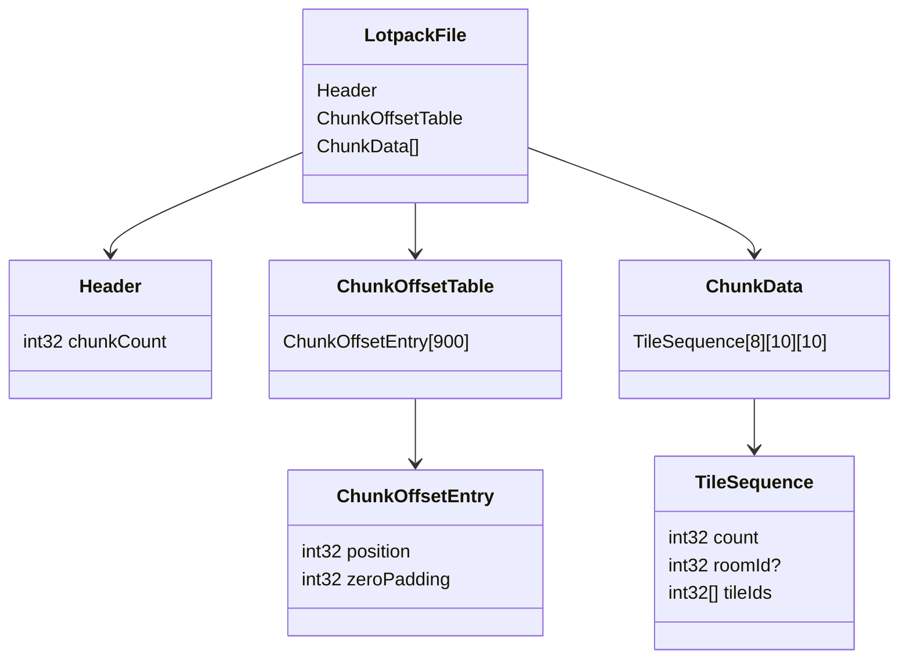

# Project Zomboid .lotpack File Format Description

The .lotpack file format is used by Project Zomboid to store map cell data. Each file represents a 300x300 tile section
of the game world, divided into 30x30 chunks of 10x10 tiles each. This specification describes both the binary structure
of these files and the correct approach to parsing them.

## File Organization

A .lotpack file consists of three main sections:

1. A header containing the number of chunks
2. A chunk offset table with positions for each chunk's data
3. The actual chunk data containing tile information

### Header Section

The file begins with a 4-byte header:

| Offset | Size | Type  | Description                                      |
|--------|------|-------|--------------------------------------------------|
| 0x00   | 4    | int32 | Number of chunks (Always 900 for standard cells) |

### Chunk Offset Table

Immediately following the header is the chunk offset table. This table contains 900 entries (one for each possible chunk
in the 30x30 grid), with each entry being 8 bytes:

| Offset | Size | Type  | Description                   |
|--------|------|-------|-------------------------------|
| 0x04   | 4    | int32 | Position of first chunk data  |
| 0x08   | 4    | int32 | Zero padding                  |
| 0x0C   | 4    | int32 | Position of second chunk data |
| 0x10   | 4    | int32 | Zero padding                  |
| ...    | ...  | ...   | Repeats 900 times             |
| 0x1C04 | 4    | int32 | Position of last chunk data   |
| 0x1C08 | 4    | int32 | Zero padding                  |

The chunk offset table has a fixed size of 7200 bytes (900 entries × 8 bytes per entry).

### Chunk Data Section

The chunk data section begins at offset 0x1C0C and continues until the end of the file. Each chunk referenced in the
offset table stores its data in the following format:

```
[Chunk Data Format]
Ordered by:
- Z level (8 levels, 0-7)
  - X position (10 positions, 0-9)
    - Y position (10 positions, 0-9)
      [Tile Sequence]
```

### Tile Sequence Format

Each tile sequence begins with a 4-byte count value that determines the sequence type:

```
[4 bytes] int32 count

if count == -1:
    [4 bytes] int32 skipCount    // Number of positions to skip
    
if count == 0:
    // Empty sequence, move to next position
    
if count > 0:
    if count > 1:
        [4 bytes] int32 roomId   // Room identifier
    [4 bytes * (count-1)] int32 tileIds   // Array of tile indices
```

## Important Format Notes

### Byte Order

All integer values in the format are stored in little-endian byte order.

### Chunk Data Storage

- Only non-empty chunks have data stored in the chunk data section
- Empty chunks are indicated by a zero offset in the chunk offset table
- There is no explicit end marker - the file ends after all chunk data is read
- Chunk positions in the offset table are absolute file offsets

### Optimization Features

- Skip sequences (count = -1) allow efficient representation of empty space
- Empty sequences (count = 0) indicate no tiles at a position
- Room IDs are only stored when a sequence has multiple tiles
- Tile definitions are stored in separate .lotheader files to reduce redundancy

## File Parsing Guide

### Required Dependencies

To properly parse a .lotpack file, you need:

1. Access to the corresponding .lotheader file for tile name resolution
2. A binary reader capable of reading little-endian integers
3. Sufficient memory to store the parsed cell data

### Parsing Process

The parsing process should follow these steps:

1. Header Parsing

```python
# Read the chunk count (must be 900 for standard cells)
chunk_count = reader.read_int32(little_endian=True)
if chunk_count != 900:
    raise ParserError("Invalid chunk count")
```

2. Chunk Offset Table Parsing

```python
chunk_offsets = {}
for chunk_x in range(30):
    for chunk_y in range(30):
        position = reader.read_int32(little_endian=True)
        padding = reader.read_int32(little_endian=True)

        if padding != 0:
            raise ParserError("Invalid chunk table padding")

        if position > 0:
            chunk_offsets[ChunkCoord(chunk_x, chunk_y)] = position
```

3. Chunk Data Parsing

```python
# For each chunk with a non-zero offset
for chunk_coord, offset in chunk_offsets.items():
    reader.seek(offset)

    # Process each position in the chunk
    for z in range(8):  # 8 z-levels
        for x in range(10):  # 10x10 tiles
            for y in range(10):
                # Read tile sequence
                count = reader.read_int32(little_endian=True)

                if count == -1:
                    # Skip sequence
                    skip_count = reader.read_int32(little_endian=True)
                    continue

                if count == 0:
                    # Empty sequence
                    continue

                # Regular tile sequence
                if count > 1:
                    room_id = reader.read_int32(little_endian=True)

                # Read tile IDs
                for _ in range(count - 1):
                    tile_id = reader.read_int32(little_endian=True)
                    # Process tile using ID and .lotheader data
```

### Tile Processing

When processing tiles, follow these rules:

1. Layer Assignment
    - Tiles containing "floor" in their name go to layer 0
    - Tiles containing "wall" in their name go to layer 1
    - All other tiles go to layer 2 (objects)

2. Position Calculation
   ```python
   cell_x = chunk_coord.x * 10 + x
   cell_y = chunk_coord.y * 10 + y
   position = LocalCellCoord(cell_x, cell_y, z)
   ```

3. Memory Management
    - Create grid squares only when tiles are present
    - Store room IDs only when provided (count > 1)
    - Release chunk data after processing to manage memory usage

## Visual Structure



## Example Chunk Data Layout

Here's an example of how a single tile sequence might be stored:

```
// Single tile at position
[4 bytes] count = 1
[4 bytes] tileId = 42

// Multiple tiles with room
[4 bytes] count = 3
[4 bytes] roomId = 12
[4 bytes] tileId1 = 24
[4 bytes] tileId2 = 56

// Skip sequence
[4 bytes] count = -1
[4 bytes] skipCount = 5

// Empty position
[4 bytes] count = 0
```

## Relationship with .lotheader Files

The tile IDs stored in the .lotpack file are indices into the tile name array stored in the corresponding .lotheader
file. This separation allows the .lotpack format to store tile references efficiently while maintaining the ability to
map these references to actual tile definitions.